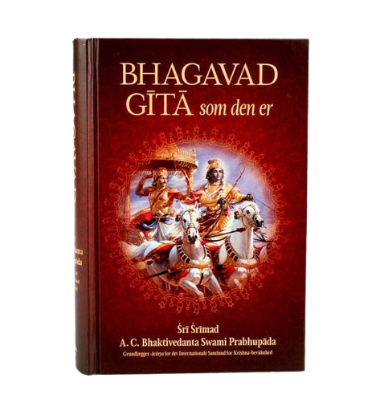
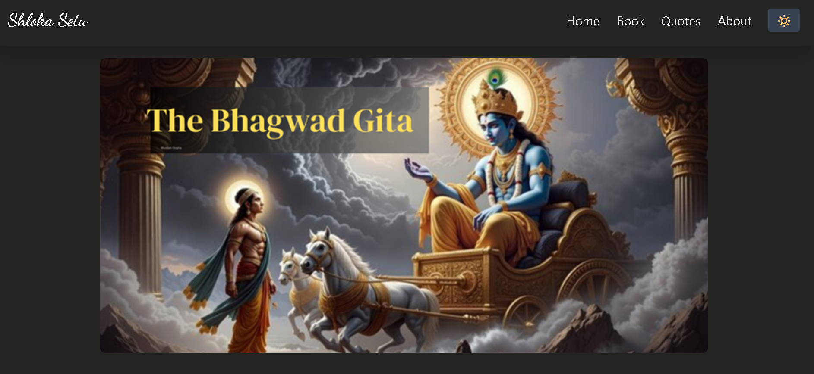
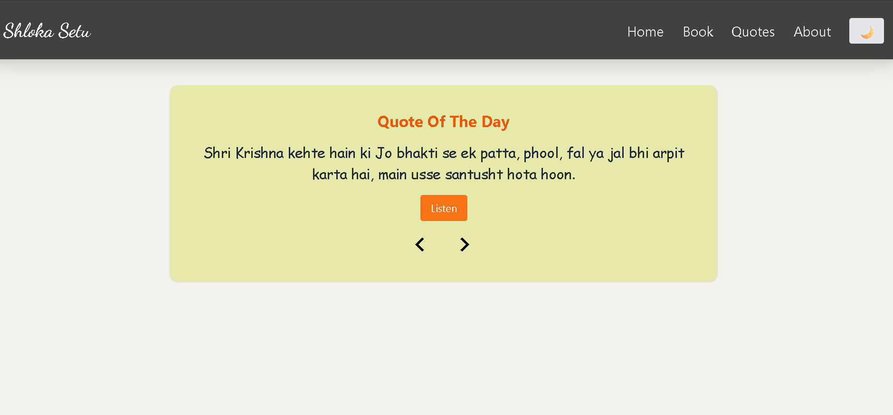
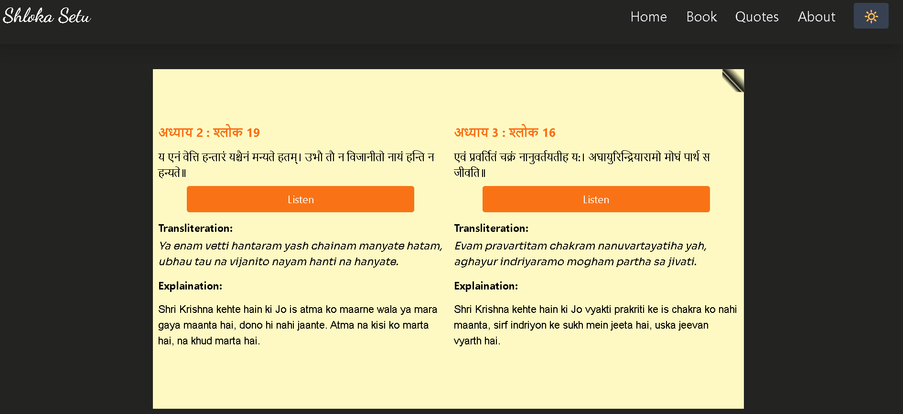
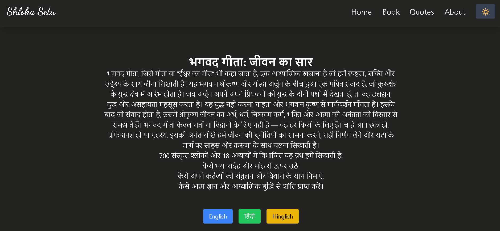
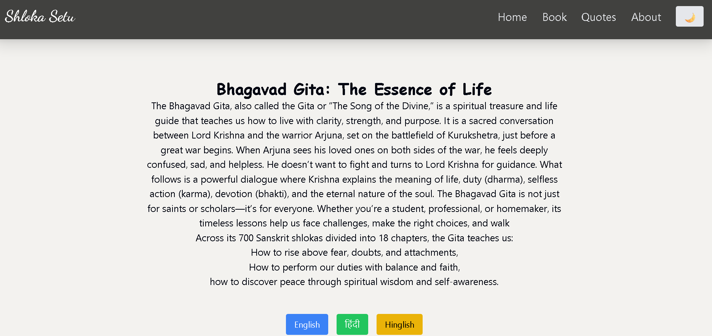

# 🌺 Shloka Setu - A Spiritual Journey Through the Bhagavad Gita

[Live Site 🌐](https://muskangupta15223.github.io/Shloka-Setu) • [GitHub Repo 📂](https://github.com/muskangupta15223/Shloka-Setu)

**Shloka Setu** is a soulful web app that brings the timeless wisdom of the *Bhagavad Gita* to the modern generation — in a beautifully minimal, interactive, and multilingual format (English | Hindi | Hinglish).

---

## Book Flip Feature

  Click on the book and see turning the feature of Gita pages

## ✨ Features

- 🔐 **User Authentication**  
  - Traditional Login/Signup with username & password (no email required)  
  - Google Sign-In powered by Firebase

- 📖 **Read Shlokas**  
  - Get shlokas by chapter, one at a time  
  - Includes Sanskrit, transliteration, and Hinglish explanation

- 🎧 **Audio Mode (Listen Button)**  
  - Listen to shlokas with soft Hindi voice-over  
  - Designed like a daily prayer companion

- 💬 **Quote of the Day**  
  - Start your day with divine energy from Gita quotes

- 🌗 **Dark/Light Theme Toggle**  
  - Choose your mood: serene light or deep night mode

- 🌍 **Multilingual UI**  
  - Read in English, Hindi, or Hinglish for better understanding

---

## 📸 Screenshots

| Login | 
|  |
|------|-----------|------------------|-----------|----------------|------------------||------------------|-----------|-------

Home Page | 
  
|------|-----------|------------------|-----------|----------------|------------------||------------------|-----------|-------

Quote Page | 
 | 
 |------|-----------|------------------|-----------|----------------|------------------||------------------|-----------|------

Book View  
 |  
 |------|-----------|------------------|-----------|----------------|------------------||------------------|-----------|--------
About Gita(in hindi) | 
 |  | 
 About Gita(in english) |
     
|------|-----------|------------------|-----------|----------------|------------------||------------------|-----------|----------------|

---

## 🔧 Tech Stack

- **Frontend**: React + Vite + TailwindCSS
- **Backend/Auth**: Firebase Authentication
- **Hosting**: GitHub Pages
- **Voice-over**: HTML5 Audio with pre-generated audio files
- **Languages**: JSX, JavaScript, HTML, CSS

---

## 💡 Inspiration

Bhagavad Gita is not just a religious book; it's a guide to life.  
I wanted to create something simple yet powerful — where even a young student or busy professional can explore **one shloka a day**, **feel the message**, and **build a spiritual habit** in this fast-paced world.

---

## 🛠️ Challenges I Overcame

- Handling **CORS issues** and API limitations 
- Making **Firebase Auth** work with both Google login and username-password method  
- Structuring the Gita data properly in JSON  
- Designing a **clean UI** that works well in both dark and light mode  
- Managing **language toggle** while keeping UI intuitive

---

## 🙏 How It's Useful

- 📚 **For Students**: Build mental strength, reduce anxiety, find motivation.
- 🧘‍♂️ **For Professionals**: Focus, clarity, and better decision-making.
- 👨‍👩‍👧 **For Families**: An easy way to reconnect with values and tradition.
- 💛 **For All**: A spiritual pause in your busy life.

---

## 🚀 How to Use

1. Visit [Live WebSite](https://muskangupta15223.github.io/Shloka-Setu)
2. Login with username-password or Google
3. Start your journey — one shloka, one insight at a time
4. Enjoy Shloka-Setu like a real book of gita.  

---

## 📬 Feedback

I would love to hear your thoughts!  
Please open an [Issue](https://github.com/muskangupta15223/Shloka-Setu/issues) or drop a message on [LinkedIn](https://www.linkedin.com/in/muskan-gupta-203bb3285/).

---

## 📌 Upcoming Features (TODO)

- ✅ Bookmark your favorite shlokas  
- ⏳ Daily shloka notification via email   
- ✅ Add user profile page

---

> _“When you feel confused or lost, let Krishna’s words guide your path.”_

---

### Made with ❤️ by [Muskan Gupta](https://github.com/muskangupta15223)

